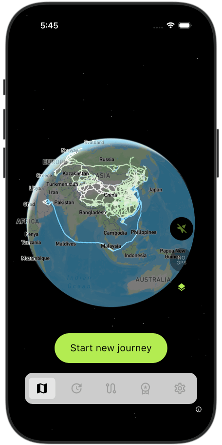
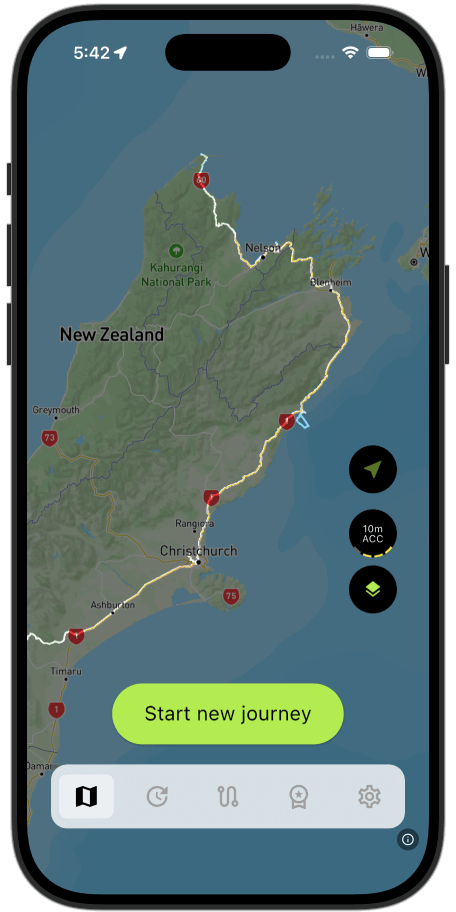

# MemoLanes(迹忆) - OSS

## This Repository(此仓库)
This repository is where we develop the open source version of MemoLanes together with the community.
The open source version contains implementations for most core functionalities.

[MemoLanes](https://app.memolanes.com/) is a distribution of this repository with our own customizations and optimizations.  

本仓库是我们与社区共同开发开源版 迹忆 的地方。
开源版本包含了大部分核心功能的实现。

[迹忆](https://app.memolanes.com/)是基于本仓库打造的定制发行版，融合了我们的额外改进与优化。

## MemoLanes(迹忆)

[MemoLanes](https://app.memolanes.com/) is a route tracking application designed to conveniently record and securely store your travel footprints while providing rich visualization. Through continuous exploration of the world, you can create unique digital traces, allowing you to revisit and relive your treasured travel memories.

### Key features

- 🗄️ **Your Data Truly Belongs to You**
    - All your journey information is securely stored directly on your device. As an open-source project, we use open data formats — empowering you to seamlessly migrate your travel history across various applications and tools, without barriers.
- 💪 **Rich & Powerful Features**
    - The *Multi-Layer* enables flexible combination and switching between footprint and flight tracks. While the *Time Machine* allows you to visually retrace your journey’s evolution on an interactive timeline. Stay tuned for more exciting features to come!
- 🧩 **Flexible & Future-Proof Architecture**
    - We have more features on the horizon. Powered by a meticulously engineered core architecture, your existing data will seamlessly integrate with future upgrades — ensuring sustainable evolution.
- ❤️ **Build This App Together**
    - Join our developer community — collaborate with us to shape the future of this application and build the tool you’ve always envisioned!

---

[迹忆](https://app.memolanes.com/)是一款轨迹记录软件，不仅能便捷记录、安全储存你的足迹，更能以丰富的形式可视化旅途数据。通过对世界的不断探索，你能留下独一无二的数字印记，追溯属于你的旅行回忆。

### 主要特点

- 🗄️ **你的数据，由你做主**
    - 所有旅程数据安全存储在本地设备。作为开源项目，我们采用开放数据格式，让你的数据能在各种应用和工具间自由迁移，畅通无阻。
- 💪 **功能强大，体验丰富**
    -  “多图层”功能助你自由组合与切换航迹和地面数据；“时光机”功能，在时间轴上回溯你的轨迹变化。更多精彩功能敬请期待！
- 🧩 **灵活架构，未来可期**
    - 我们已规划更多功能，基于精心设计的底层架构，现有数据能无缝适配未来新功能升级，确保持续发展。
- ❤️ **携手共建，开发生态**
    - 加入开发者社区，共同参与应用开发，携手打造你理想中的应用。

## License & Contributing

By default, we release the code under the GPLv3 license. We do so to ensure derivative works remain open-source and contribute back to the community. 

We may also be willing to grant you a non-GPL license upon specific requests (either open an issue or email us). In general, we welcome helpful utilities to be developed based on MemoLanes for good purposes, either closed-source or open-source. 

In order to achieve this, we also need any new contributor to sign a contributor license agreement so that we can reuse the code in our closed-source MemoLanes App or other products.
For more information about contributing and the CLA process, please see our [Contributing Guidelines](.github/CONTRIBUTING.md).

---

默认情况下，我们在 GPLv3 许可证下发布代码。这样做是为了确保衍生作品保持开源并回馈社区。

如有特定需求，我们也愿意向您授予非 GPL 许可证（请开启 issue 或发邮件给我们）。总的来说，我们欢迎基于 迹忆（MemoLanes） 开发有益的实用工具，无论是闭源还是开源。

为了实现这一点，我们也需要新贡献者签署贡献者许可协议，以便我们可以在闭源的 迹忆（MemoLanes） 应用或其他产品中重复使用代码。
有关贡献和 CLA 流程的更多信息，请参阅我们的[贡献指南](.github/CONTRIBUTING.md)。

## Dev Env Setup
There are two main components of this app: 1. A rust library for the core logic; 2. a flutter project for the app itself. If you are only going to touch the rust core library then only 1 is required. However, working on the flutter project requires a full setup.

### 1. Rust Core Library Setup
1. Install [Rust](https://www.rust-lang.org/tools/install).
2. Install [protobuf](https://grpc.io/docs/protoc-installation/).
3. Install `just`. You can do it with `cargo install just` or use other package manager mentioned [here](https://just.systems/man/en/packages.html).
4. Go to `/app/rust` folder.
5. (If you are downgrading from a full setup, delete `src/frb_generated.rs` if it exists).
6. Run relevant cargo command to make sure the setup is completed (e.g. `cargo check`, `cargo test`).

### 2. Flutter Setup
1. Install [Flutter](https://docs.flutter.dev/get-started/install).
2. Install [flutter_rust_bridge](https://cjycode.com/flutter_rust_bridge/quickstart). It is recommend install the specific version that this project is using by `cargo install 'flutter_rust_bridge_codegen@2.12.0'`. The real version can be found using `just get-frb-version` or looking at `app/pubspec.yaml`.
3. Install [yarn](https://yarnpkg.com/getting-started/install). Go to `/app/journey_kernel` folder. Install node packages by `yarn install`.
4. Go to `/app` folder.
5. Running pre-build via `just pre-build`. Note that this need to be reran every time rust api or journey kernel is updated.
6. Start the app via `flutter run`.
7. `just` provides many useful commands, e.g. `just format`, `just check`, `just test`. Consider run those before opening/updating PRs.
