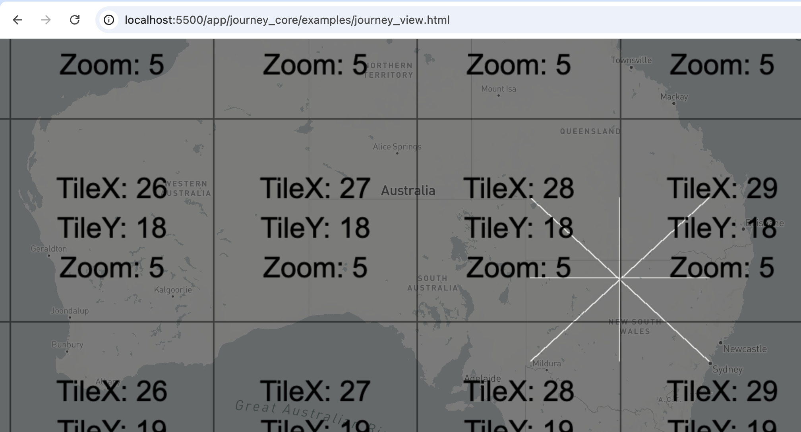

# Journey Kernel Library

This library is used to render journey bitmaps in the app. It supports both native and WASM.

## Notes

The design goal of the example is simple to use in development and production.

We split the APIs (and make many HTTP calls inside the HTML) so that the file will work seamlessly both in a local static server and the in-app dynamic server.

## Static server example

This example helps you to understand how the WASM module works through any static server (e.g., VS Code Live Server).

1. **Build the package:**

   ```bash
   wasm-pack build --target web --features wasm --no-default-features
   ```

2. **Run the tests natively:**

   The test will generate the `journey_bitmap.bin` file.

   ```bash
   cargo test
   ```

3. **Verify `setup_token.py`:**

   Ensure `setup_token.py` has been executed again, and there is a `token.json` in the `static` folder.

4. **Check links in `journey-view.html`:**

   Make sure links to `journey_bitmap.bin` in `static/journey-view.html` are correct.

5. **Open `journey-view.html` in a browser:**

   You may see the following effect (the look may be different since we have updated since the screenshot):

   

## Dynamic server example

The dynamic server is used in the app. The server supports dynamically registering and unregistering journey bitmaps.

Run the following command in the `app/rust` folder:

```bash
cargo run --example server
```

